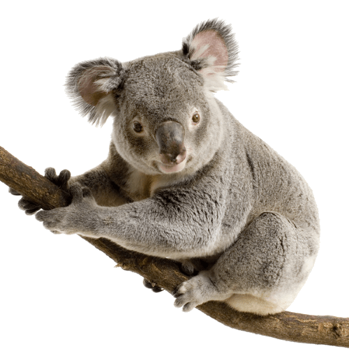

```{r}
#| label: fig-penguins-scatter
#| fig-cap: "Body mass vs. Flipper length for three penguin species."
#| warning: false
library(ggplot2)
library(palmerpenguins)

ggplot(penguins, aes(x = flipper_length_mm, y = body_mass_g, color = species)) +
  geom_point() +
  theme_minimal()
```

@fig-penguins-scatter illustrates the relationship between flipper lenght and body mass between different pengiun species.


```{r}
#| label: tbl-penguin-summary
#| tbl-cap: "Mean body mass of penguins by species and sex."
#| warning: false
#| echo: false
library(dplyr)

penguins |>
  filter(!is.na(sex)) |>
  group_by(species, sex) |>
  summarise(mean_mass = mean(body_mass_g)) |>
  knitr::kable()
```

@tbl-penguin-summary summarises the average body mass of penguins by sex and species. 
Try to avoid using space in table or figure name. Use '@' follows by figure/table names to reference them.

## Reference
This dataset is sourced from [@penguin_data]

This dataset is sourced from @penguin_data

It works with or without '[]' but without the '[]' the name of the author will not be within a '()'. can be used like below;

@penguin_data argued that penguins xxx.

## More figures

```{r}
#| label: fig-penguins-species
#| fig-cap: "Bill length vs Body mass by species"
#| warning: false
#| echo: false
data(penguins)
View(penguins)

ggplot(penguins,aes(x = bill_length_mm, y = body_mass_g, color = species)) +
    geom_point()
```


```{r}
#| label: tbl-penguin-summary-by-island
#| tbl-cap: "Summary penguin by island and species"
#| warning: false
#| echo: false

penguins |>
  group_by(species, island) |>
  summarise(avg_mass = mean(body_mass_g, na.rm = TRUE), avg_flipper = mean(flipper_length_mm, na.rm = TRUE), count = n()) |>
  knitr::kable()
```

{width=200}

[](https://en.wikipedia.org/wiki/Ad%C3%A9lie_penguin)

## how to add image
begin with ! follow by a caption within '[]' and image file in '()'
this is when an image is saved within a local file

begin with ! follow by a caption within '[]' and image url in '()'
this is when an image is not saved within a local file, and we will use an image url instead

### to make an image a clickable link
#### [](url link that we want the image to link to)

#### use zbib.org to create a citation to put in a .bib file, paste a url and select BibTex then copy and paste in a .bib file
